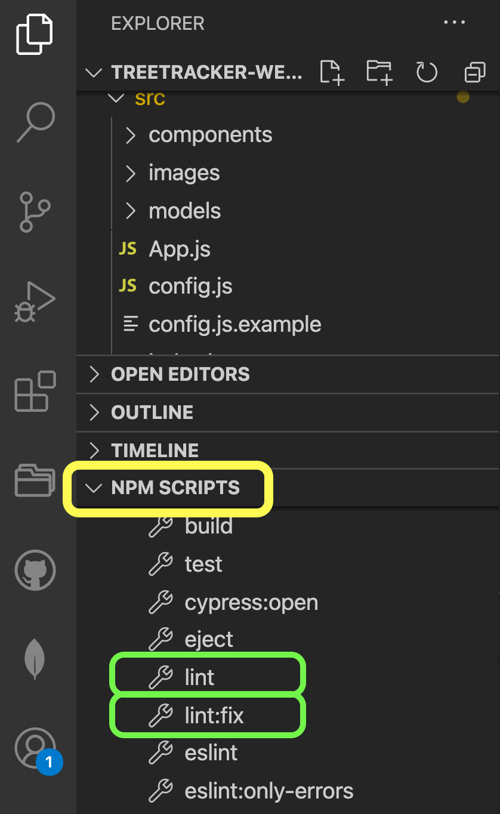

# Treetracker Web

## Current Milestones and Issue Topics

**Good first issues** for new contributors can be found here:
https://github.com/Greenstand/treetracker-web-map-client/issues?q=is%3Aissue+is%3Aopen+label%3A%22good+first+issue%22

Developers please see current milestones here:  
https://github.com/Greenstand/treetracker-web-map/milestones

Big picture UX/UI challenges are tracked at:  
https://github.com/Greenstand/treetracker-web-map/issues?q=is%3Aissue+is%3Aopen+label%3AUX%2FUI

&nbsp;
&nbsp;

## Project Description

Displays location and details of all trees that have been tracked.

Live map is at [www.treetracker.org](https://www.treetracker.org)

For more details see the [Tree Tracker Web Map Wiki] (https://github.com/Greenstand/treetracker-web-map-client/wiki)

&nbsp;
&nbsp;

## Development Environment Quick Start

### Using online DB (Recommended)

#### Frontend Only

1. Make sure all npm modules are installed for client.

```
npm i
```

2. Open .env from the project root. It should contain only the following lines

```
REACT_APP_API=https://dev-k8s.treetracker.org/webmap/
```

3. Start the client

```
npm start
```

4. Open the web map in the browser with URL: http://localhost:3000

## Code style guide

We follow the Airbnb JavaScript style guide. The superficial aspects of this style are enforced by a pre-commit hook in the project that runs [Prettier](https://prettier.io/) when you commit a change.

If you are using VSCode as your IDE, please follow [this guide](https://www.digitalocean.com/community/tutorials/how-to-format-code-with-prettier-in-visual-studio-code) to set up Prettier and automatically format your code on file save.

### Rules

In .eslintrc.json, there is a set of rules with status **off or warn**. Whenever you are developing a new file or an existing file try to correct some warnings, because in the future the rules will be activated.

**For more information about rules:** https://eslint.org/docs/2.0.0/rules/

**Airbnb Style Guide:** https://airbnb.io/javascript/

<sub><sup>**Indention:** 2 Spaces for indentation</sup></sub>
<sub><sup>**Semicolon:** Use semicolons at the end of each line</sup></sub>
<sub><sup>**Characters:** 80 characters per line</sup></sub>
<sub><sup>**Equal Equal (eqeqeq):** Good practice to use the type-safe equality operators === and !== instead of their regular counterparts == and !=</sup></sub>
<sub><sup>**Quotes:** Use single quotes unless you are writing JSON</sup></sub>

```js
const foo = "bar";
```

<sub><sup>**Braces:** Opening braces go on the same line as the statement</sup></sub>

```js
if (true) {
  console.log("here");
}
```

<sup><sub>**Variable declaration:** Declare one Variable per statement</sup></sub>

```js
const dog = ["bark", "woof"];
let cat = ["meow", "sleep"];
```

<sup><sub>**Variable, properties and function names:** Use lowerCamelCase for variables, properties and function names</sup></sub>

```js
const adminUser = db.query("SELECT * From users ...");
```

<sup><sub>**Class names:** Use UpperCamelCase for class names</sup></sub>

```js
class Dog {
  bark() {
    console.log("woof");
  }
}
```

<sup><sub>**Descriptive conditions:** Make sure to have a descriptive name that tells the use and meaning of the code</sup></sub>

```js
const isValidPassword =
  password.length >= 4 && /^(?=.*\d).{4,}$/.test(password);
```

<sup><sub>**Object/Array creation:** Use trailing commas and put short declarations on a single line. Only quote keys when your interpreter complains:</sup></sub>

```js
var a = ["hello", "world"];
var b = {
  good: "code",
  "is generally": "pretty"
};
```

### How to test the rules

In package.json, there is a topic called **scripts** that contains many scripts to be executed.
To validate the rules manually, you must run and check that there is no error in your development:

```
npm run eslint
```

You will be able to run through this shortcut in VSCode


To fix automatic rules

```
lint:fix
```

### How to test

We use Jest to build tests.

1. To test client

```
npm test
```

### Alternative development environment for MS Windows (Works on Linux and Mac also)

On Windows, the easiest way to develop and debug Node.js applications is using Visual Studio Code.
It comes with Node.js support out of the box.

https://code.visualstudio.com/docs

&nbsp;
&nbsp;

## Clustering Basics

For performance and UX purposes, since this map needs to deal with an enormous amount of trees, a clustering strategy is used to group those trees, showing information in a way that is more digestible for the end-user.

Although this feature is already implemented, performance optimizations are a work in progress.

### Overriding clustering and map initial zoom for testing

When there is a need to tweak the clusterization behavior, the **cluster radius** and **zoom** can be overridden specifying query strings.
For example, if you need to load the map with an initial zoom level of 15, and a radius of 0.001 you will access it like this:

dev.treetracker.org?**zoom=15&clusterRadius=0.001**

To find the correct value for the cluster radius in a given zoom level, play with some ranges between 0.1 and 0.00025. However, feel free to experiment however you like.

When these values are overridden, you can zoom and drag the map freely, while keeping the same clusterization behaviors.

Another useful tool to use in conjunction with this is the web browser's console (in Chrome or Firefox, hit F12 to open it). Whenever the map is updated, current zoom level and cluster radius used will be output to the console, so you have a better idea of what is going on.

Future:

- Filters and Statistics
- View photo together with tree data
- View planter profile.
